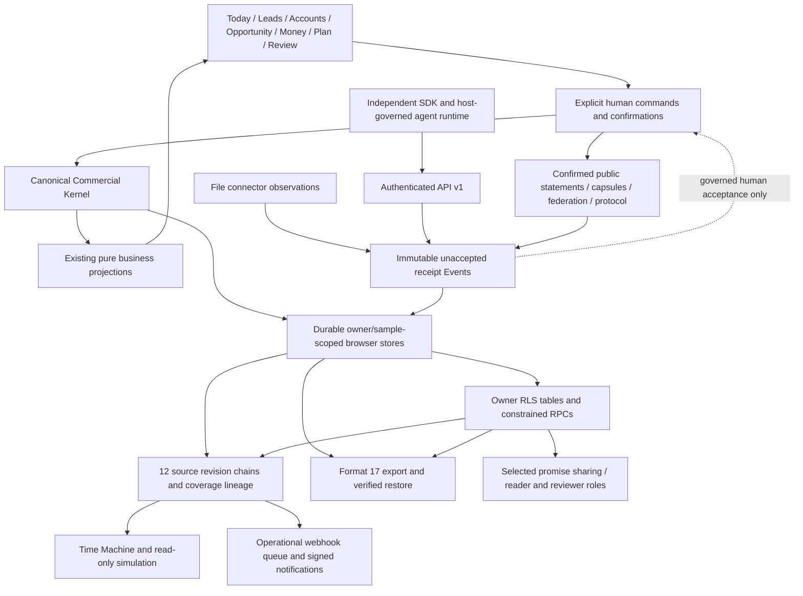

# Memoire system architecture at M28

This map describes the implemented local roadmap through M28. Production deployment is pending P1. Earlier R1 architecture records retain their M2–M11 release boundary; this document adds the later layers without changing that historical scope.

Addendum 2026-10-01: user-authorized portfolio work adds an owner/sample-scoped Products & Brands catalog under Review, primary opportunity classification and backup format 16. See [implementation scope](../product/portfolio-foundation-implementation-2026-10-01.md). This is separate from the M12–M28 completion record and has not been deployed to Production.

The next user-authorized step adds typed Reports under Review: current opportunity/collections datasets, saved versioned definitions, shared portfolio metrics and order-to-cash derivations, source drill-through, CSV/metadata export and bounded browser printing. `report_definitions` has owner-only RLS and revision-chain checks; backup format 17 includes definitions/history. Run results are transient captured current views, not transactionally complete or historical snapshots. See [Reports implementation scope](../product/reports-foundation-implementation-2026-10-01.md). Dashboard builder remains the next step; these migrations have not been applied to Production.

## Canonical meaning and derivation

Accounts, Opportunities, Threads, commitments, business Events, Evidence and outcomes retain existing contracts. Conditions, Requirements and Dependencies model explicit prerequisites; Timing records assertions; Money Gates model relationships without inventing amounts. Existing derivations determine epistemics, resolution, blockers, defensibility, timing and money consequences. Decisions, execution links and Decision Observations remain distinct from recommendations, actions and outcomes. Scenarios are transient/read-only; learning describes observed associations with provenance and sample thresholds rather than inventing causality.

M12 policies are explicit human rules with versions. M13 incidents record material deviations and human coordination. M14 attention allocation is an explainable bounded selection over existing recommendations, never autonomous decisions. M15 operational contract clauses link to existing Requirements, commitments, timing and money; accepted text is human-entered, not legal AI truth. M16 team coordination reuses internal commitments and derived review. M21 adds actual authenticated sharing authority separately from personal owner scope.

## Durable state, history and recovery

`canonicalContracts` in `src/services/canonicalDurability.ts` is the backup/restore inventory: six relational families, 16 Kernel codecs, legacy JSON collections and commercial targets. `historicalSources` in `src/services/historicalIntegrity.ts` lists exactly 12 revision-covered mutable sources: Opportunities, Conditions, Evidence, Requirements, Dependencies, Timing, Money Gates, policies, incidents, contract obligations, workspaces and commitments. Immutable Decisions/observations and semantic receipt/issuance Events retain their own fact contracts; **Event is not State Revision**.

Required-history writes and database triggers retain transaction/rollback, owner/sample and sequence contracts. Compressed browser history is lossless; restore retains original coverage/lineage, refuses corrupt/divergent histories and uses rollback journaling. Format 15 preserves canonical sharing configuration and immutable actor/receipt/publication facts. Runtime workspace access epochs are database-generated and excluded from restored authority: actual restored membership needs fresh actor acceptance. Operational webhook deliveries are export archives and are never replayed as browser business commands.

Historical readers use system knowledge cutoffs and explicit coverage. Before coverage, or when required sources are unavailable, they report uncertainty. Buyer Progress and Money consequence historical readings remain limited by unversioned legacy Activities, Quotes/Receivables and unsupported payment/PO alternatives. A received public artifact uses its local receipt time, irrespective of claimed issue time. No shared message is an automatic accepted historical business source.

## Integration and authority

| Layer | Implemented boundary | Persistent versus derived |
|---|---|---|
| M17 event fabric | Bounded immutable external source tuple, receipt-time history, owner/sample scope | Receipt Event persists; contents stay unaccepted |
| M18 connectors | Explicit reviewed file/export adapters for CRM, email, calendar, ERP and finance | Observations only; no vendor-specific business rules, OAuth or polling |
| M19 API | Verified user bearer token, caller-token RLS, current commitment/page-recommendation reads, observation receipt only | Existing receipts; no generic persistence endpoint or consequential business commands |
| M20 webhooks | Scheduler-only operational queue, stable revision notifications, HMAC, leases and bounded retries | Delivery audit persists separately; 2xx is transport acknowledgement, not outcome proof |
| M21 sharing | Owner-selected promises, explicit actor invitations, reader/reviewer roles, current-epoch consent | Versioned owner configuration and immutable actor facts; bounded member view is transient |
| M22 SDK | Independent TypeScript/ESM API wrapper with typed DTOs and honest uncertain-write errors | No application stores, secrets, hidden retry or new state |
| M23 agents | Pinned owner token; bounded observation/proposals; optional expiring host grant for original receipt envelopes | Ephemeral grants/proposals; only M17 receipts persist; no consequential business executor |
| M24–M27 public exchange | Explicit minimal promise disclosure, capsule verification, two-party federation and existing graph slice | Immutable disclosure Events and received claims; derived views, no shared database/consensus |
| M28 protocol | Versioned ten-concept snapshot, bounded scope, optional whole-message signature, predecessor/conflict visibility | Derived download and existing unaccepted receipt; no new mutable entity |

Private owner RLS is not widened for shared-workspace members or declared external parties. Actor RPCs bind to `auth.uid()` and current consent/role. Public aliases and explicitly selected claims keep internal account/opportunity/thread/requirement IDs and raw private Evidence out of external artifacts. Company names, signatures, agent labels and invite labels cannot confer authority. Consequential acceptance, completion, Decisions, access changes and money actions remain governed by existing explicit commands and confirmation.

## Surfaces and deployment

Seven primary destinations remain Today, Leads, Accounts, Opportunities, Money, Plan and Review. Rich domain controls live in contextual folded sections; history and simulation remain contextual. Sharing, exchange and protocol add no new primary destination or giant platform UI.

Vercel application deployment and Supabase schema deployment are separate gates. The configured Supabase target was identified as `mlmpcpkucurylkrobain`, with Memoire and Helm coexisting in public schema, in the September 28 audit. That catalog is not a backup and is not re-certified by local tests. October 1 CLI access still lacks a token/link and recovery tooling. No production mutations, migration-ledger repairs, pushes or deployments were performed by this completion run. See [P1 audit and recovery path](../deployment/p1-production-audit-2026-09-28.md).

## Known limitations and deliberate non-goals

The pre-existing Today three-move compositor and Kernel review ranking remain separate. Legacy mutable Quote/Receivable/Activity history is incomplete; affected historical projections fail conservatively. API quotas are process-local; pagination and separate agent reads are not an atomic snapshot. Shared views are bounded, and revocation denies subsequent reads but cannot erase copies already disclosed. Agent grants/proposal logs are ephemeral host responsibilities, not a distributed quota or durable agent audit service. Cross-company preview source fingerprints conservatively include all owned Evidence and may invalidate on unrelated changes.

This release does not add legal interpretation/document signatures, automatic policy learning, autonomous consequential actions, OAuth/live connector polling, a public SDK publication, a durable distributed agent scheduler, universal organization administration, verified corporate identity/key custody, shared accepted commercial truth or a shared cross-company database. Webhook subscriptions are deployment-managed, currently unconfigured, and conservatively support public IPv4 HTTPS only. Message downloads do not prove delivery or acceptance. Undisclosed Condition and Money references remain empty in Memoire's protocol adapter; external providers may declare them under the same unaccepted wire contract. These limits are stated interfaces, not fabricated completed workflows. No M29 is proposed.
