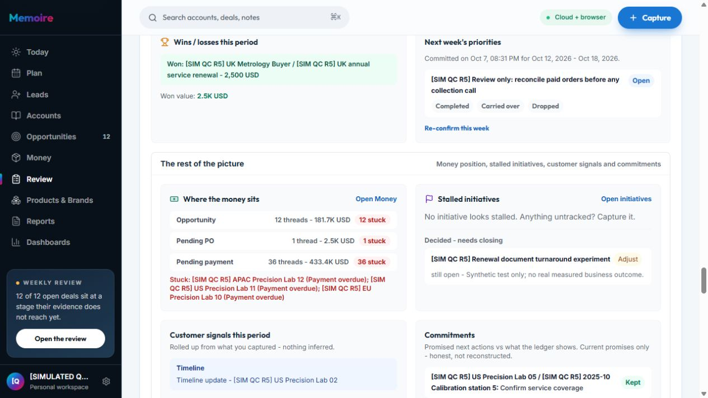

# Memoire — strict user audit R5, 6–7 October 2026

## 1. Kết luận

**NO-GO cho tuyên bố toàn bộ vòng vận hành B2B đã đáng tin cậy.** Collections, Reports và phép đối soát độc lập tính đúng tiền, nhưng Review vẫn đọc một phần trạng thái cũ, báo đơn đã thu đủ là quá hạn. Bản export cloud nguyên trạng của chính tài khoản bị Restore từ chối sau khi tạo incident qua UI.

Vòng này ghi nhận **2 P1 và 9 P2** bên dưới, cùng các vấn đề chất lượng/copy cần cải thiện. Đây là audit mới trên production; không dùng kết quả R4 làm bằng chứng đạt R5. Không sửa ứng dụng hoặc triển khai trong vòng này.

Source checks: **117/117 nhóm đạt**, gồm build, 113 contract checks, API typecheck, lint và unit. Unit: **2.118/2.118 test, 339 suites, không fail/skip**. **13 phép thử isolation đạt**: 10 bảng không lộ record của owner QC khác, ba request export thiếu/invalid token hoặc sai owner bị từ chối. Những kết quả này không thay thế nghiệm thu luồng người dùng hoặc chứng nhận security toàn sản phẩm.

## 2. Tài khoản mới và mô hình business

- Business: **[SIMULATED QC R5] Orion Calibration Partners**, phân phối thiết bị/dịch vụ hiệu chuẩn công nghiệp tại EU, Mỹ và APAC.
- Owner mới: `bf8bedf4-782b-4234-9973-2b4cebe8785c`. Baseline xác nhận chín bảng chính rỗng trước khi nhập dữ liệu. Đăng nhập và onboarding được chạy bằng UI. Tài khoản được provision qua công cụ admin; **không chứng nhận public signup/email/ToS end-to-end**.
- Kỳ giả lập: **10/2025–09/2026**, sáu cơ hội mỗi tháng: ba Won, một Lost, một Proposal, một Lead; ba tiền tệ USD/EUR/SGD; hai brand ID-linked CalPro/Inspectra.
- Tỷ giá planning độc lập dùng để đối chiếu: USD=1, EUR=30/26, SGD=20/26. Không dùng tỷ giá thị trường trực tiếp.
- Báo giá rejected R1 và accepted R2 cùng deal không tạo hai đơn. Receipts gồm trả đủ, trả 50% và trả 104%; dư thu tách riêng, số nợ mỗi đơn chặn ở 0. Landed cost baseline 65% và gross margin 35%.
- Twelve-month fixture được nạp từng tháng bằng harness; **mỗi checkpoint được đọc và đối chiếu bằng Collections UI**. Đây là lịch sử business dates giả lập, không phải chạy 12 tháng thời gian thật hoặc chứng minh mọi historical snapshot tại ngày cũ.
- Sau baseline, thao tác UI tạo UK renewal 2.500 USD, thu 1.250+1.325, chi phí 1.750; thêm receipt thử 1 EUR trên một đơn cũ, hai account chỉ dùng Merge/Undo, hai objections, hai assets tự tạo/generate và bộ mẫu công nghiệp.

Production đã kiểm tra: `https://www.memoire-official.com`, Vercel READY `dpl_9euRaqCVNxchQsQ8fGHecWFT9ruw`, commit `c2b0d8d561eb0c5e209856a5e2984ae28c819a52`. Commit này là descendant chỉ đổi docs của application version đã kiểm tra. Supabase `mlmpcpkucurylkrobain`; không chạy DDL/migration.

## 3. Journey thực tế

1. Provision owner rỗng → đăng nhập UI → onboarding USD → thử currency thiếu rate → trở lại USD.
2. Nạp tháng 1–12 theo fixture, mở Collections và đối chiếu order value/received/outstanding tại từng checkpoint; xây Dashboard năm và inspect nguồn.
3. Vận hành sau năm: Plan, lời hứa, raw/quick Capture, import account/contact, People, Lead nurture/disqualify/reopen/qualify, decision/evidence/requirements/timing/policy/incident.
4. Báo giá → Accepted → Won → milestones → hai receipts có overpayment → landed cost/margin → supplier document promise → Product/Brand classification → Reports/Dashboard save/archive/restore/reload.
5. Search → scoped Ask/follow-up draft → unsupported query; Objections → Operating experiment; Review/coordination/external preview/negative protocol guards.
6. Backup raw bị chặn → fixture cùng thời điểm đã chuẩn hóa riêng → Restore thật → Undo browser → reload/cloud export; nhập tuần và hoàn thành Internal Desk work; confirm tuần/recap; mở Assets/Playbook → tạo/copy/import/deduplicate/generate draft.
7. Kiểm tra Settings/public funnel/Founder gate; Merge → Undo → reload; Coverage; đối soát cuối và kiểm tra lại Review sau reload.

Nhật ký số thứ tự và DOM/screenshot gốc: `.audit/global-b2b-round5-2026-10-06/journey.json`. Ảnh sai hoặc chưa ổn định bị loại: 6/7 là trạng thái cũ; 51 chụp Settings thay cho History; 53 còn đang refresh; 55 vẫn là desktop dù công cụ báo resize. Các ảnh có đối tượng nằm ngoài viewport chỉ được dùng làm DOM proof, không nhận là visual proof cho đối tượng đó.

## 4. Ma trận 38 khu vực

PASS chỉ áp dụng thao tác và giới hạn ghi trong hàng. PARTIAL có phần đã dùng và phần lỗi/chưa phủ; BLOCKED có prerequisite; NOT VERIFIED không có bằng chứng đạt. Không tuyên bố 100% mọi action/biến thể đã được kiểm tra.

| # | Khu vực | Kết quả R5 và phạm vi thực tế |
|---|---|---|
| 1 | Today | PARTIAL: pipeline 181,7K, overdue 85,7K/12 đơn đúng; snooze/dismiss/bring back/reset dùng được. Read models trong Review chưa thống nhất, R5-01. |
| 2 | Plan | PARTIAL: week/month/history, paste hai Internal tasks, sửa ngày, complete → activity cloud; lời hứa/dời hạn/kept. Customer Desk work R5-05, fold tuần R5-10. Không chứng nhận mọi kiểu drag/drop. |
| 3 | Leads | PASS trong chu kỳ thử: tạo trên account đúng ID → nurture → disqualify Timing → reopen → qualify Discovery → Won. Không nhận qualify là buyer authority. Duplicate person R5-08 nằm ở People. |
| 4 | Accounts | PARTIAL: CSV một mới/một trùng; archive/unarchive; People/Memory; Merge hai fixture 15→14→15 và reload vẫn 15. Contact import R5-07. Native account file upload chưa phủ. |
| 5 | Opportunities | PARTIAL: Lost/reopen/Won, synthetic retrospective; counterfactual không đổi close date chuẩn; sâu hơn được tách ở hàng 21–25. Không chứng nhận tất cả CSV CRM mappings. |
| 6 | Money | PASS trong sổ đơn thử: 37 orders, accepted ID-linked quotes, receipt/overpayment/milestones/cost/margin, supplier promise, targets. Không có giao dịch tiền thật. Review integration R5-01 chưa đạt. |
| 7 | Review | PARTIAL: weekly/analytics, brief copy, recap 5 activities, custom weekly commitment confirm và reload; execution/pattern đọc được. R5-01 và R5-11 làm review chưa đầy đủ/đúng. |
| 8 | Products & Brands | PASS: tạo product, classify UK deal, retire/reactivate giữ một liên kết và version; performance totals. Không chứng nhận bundle allocation/parent rollup không được sản phẩm hỗ trợ. |
| 9 | Reports | PASS phạm vi create/save/run/group brand/duplicate/archive/restore/reload, Collections 37 đơn khớp oracle. UI CSV file chưa thu được để xác minh nội dung. |
| 10 | Dashboards | PARTIAL: ba widgets, save/layout, source inspect, archive/restore/refresh giữ cấu hình và 37 nguồn. Coach chặn Restore R5-09; inspect thiếu đưa người dùng tới panel. Export file chưa kiểm chứng. |
| 11 | Quick Capture | PASS save/reload trong tình huống US call và UK renewal meeting; không tự thay quote/payment. Không chứng nhận microphone. |
| 12 | Raw Capture | PARTIAL: parse/review/correct type/ignore link/fact/save; R5-03 tồn tại hai next-action representations không đồng bộ. Không đánh đồng tooling date fill với lỗi sản phẩm. |
| 13 | External observations | PASS email fictional nhận một lần/dedup; CRM JSON file chooser preview/receive/dedup; schema sai bị chặn. Receipt vẫn unaccepted. Không nối mailbox/CRM thật. |
| 14 | Search | PASS tìm renewal, mở record và truyền nguyên query sang Ask. |
| 15 | Ask | PASS trong scoped record summary/draft/open account; query luật VAT ngoài phạm vi được từ chối rõ, không bịa câu trả lời. Không gửi draft. |
| 16 | Business Vault / Coverage | PASS đọc account history/map và customer×brand grid; UK renewal thuộc CalPro 2,5K, Inspectra là gap; link quay đúng account. |
| 17 | Stakeholders | PARTIAL manual Technical Buyer/influence/stance/evidence tồn tại cloud; CSV thiếu People và lead thêm Casey thứ hai, R5-07/08. |
| 18 | Objections | PARTIAL create/Addressed/Resolved/reload, response/proof giữ cloud; timezone Resolved at sai R5-06. Hai Documentation responses mở được library gate. |
| 19 | Operating System | PASS experiment/expected result/signal/Adjust/reason/next date/value USD save và reload. Không suy diễn test signal thành measured business outcome. |
| 20 | Playbook / Assets | PASS phạm vi gate → pattern search/read/copy → generated asset draft save; manual asset copy/reload; Industrial pack 12 rồi skip 12 duplicates. Cloud 14 assets. Không chứng nhận tất cả pack/template type. |
| 21 | Decision observation | PASS observation trước cutoff bị chặn, observation hợp lệ được lưu và reload. Không chứng minh quan hệ nhân quả. |
| 22 | Evidence/condition/requirement | PASS synthetic proof/Supported/Met/reference scope được lưu/reload. Không phải acceptance thực. |
| 23 | Policy/incident | PARTIAL policy/incident create, close khi rule unmet bị chặn, Keep open version 2 giữ cloud. Incident Review loading R5-11. |
| 24 | Timing/money gate | PASS thử duration 3 ngày, anchor Nov30, potential gate/reason; canonical close date giữ nguyên qua counterfactual. Chưa phủ mọi loại contractual dependency. |
| 25 | Contract obligations | FAIL tình huống mapping với commitment do Capture tạo: Save bị scope guard chặn R5-04. Chưa tạo valid accepted contract obligation; không coi preview là ký hợp đồng. |
| 26 | Internal coordination | PASS lưu promise coordinator/ref giả lập, preview/copy/reload. UI xác nhận không gửi notification hay access invitation. |
| 27 | External statement | PARTIAL preview promise đã kept, recipientAccepted=false/completion proof null hiển thị đúng. Chưa issue/receive/accept statement thực. |
| 28 | Shared access | BLOCKED/READ ONLY: refresh 0 invitations, Manage form, Save disabled thiếu invited owner. Không có grant hoặc two-owner acceptance. |
| 29 | Federation/cross-company | BLOCKED: thiếu saved canonical thread/checked exchange; prerequisite guard được thử. Không có giao dịch liên công ty thành công. |
| 30 | Protocol/trust capsule | PARTIAL negative preview schema invalid bị từ chối. Chưa có valid signed capsule/protocol roundtrip. |
| 31 | Settings account/billing/privacy | PASS phạm vi đọc profile/plan/privacy/boundaries; checkout closed, no subscription. Không đổi password hoặc mua gói. |
| 32 | Currency/planning FX | PARTIAL USD→EUR→AFN thiếu rate guard→cancel→USD; baseline conversion oracle đúng. Chưa chạy lại full report dưới EUR hoặc feed tỷ giá trực tiếp. |
| 33 | Sync/recovery/storage | PASS phạm vi Retry pending→Available/None known, storage quota/collections đọc được. Không chứng nhận offline/reconnect hay network conflict đa thiết bị. |
| 34 | Export/restore | PARTIAL: own API manifest 56 bảng complete; raw restore FAIL R5-02; normalized nominal fixture Restore complete 1.305 replay records/46 stores → Undo → cloud financial integrity PASS. Native ZIP/CSV download artifact chưa thu được. |
| 35 | Founder import | BLOCKED: `/app/imports` chuyển về Today với owner thường; không nâng quyền để kiểm thử. Account CSV là flow khác. |
| 36 | Public funnel | PASS phạm vi đọc home/pricing/use cases/two guides/privacy/terms/boundaries; fresh signup empty validation. Preview pricing thống nhất Billing; không submit guided access hoặc accept ToS. |
| 37 | Mobile | NOT VERIFIED: yêu cầu 390×844 trả thành công nhưng DOM thực 1280×720 và ảnh desktop. Đã reset override. Không dùng kết quả mobile R4 thay thế. |
| 38 | Retired/deep links | PARTIAL observed Activity link trỏ ledger thuộc Plan/History; Founder gate giữ scope. Không chứng nhận mọi retired-route redirect. |

## 5. Kết quả tài chính độc lập

Baseline năm: 12 accounts, 72 opportunities, 216 activities, 72 quotes, 36 orders/receivable/cost records. Mỗi tháng UI Collections khớp oracle với sai số hiển thị tối đa 0,01 USD. Bảng checkpoint chi tiết ở phụ lục tự đối chiếu bên dưới.

Cuối vòng, cloud export `2026-10-07T13:45:02.753Z`: **56 bảng, 972 bản ghi**, manifest complete; 15 accounts, 73 opportunities, 221 activities, 73 quotes, 37 receivables, 37 costs, 3 plan items, 2 objections, 14 assets, 1 weekly commitment, 24 commercial events.

| Chỉ tiêu USD quy đổi | Kỳ vọng | Thực tế |
|---|---:|---:|
| Số đơn | 37 | 37 |
| Giá trị đơn | 435.884,62 | 435.884,62 |
| Đã thu | 354.949,23 | 354.949,23 |
| Còn phải thu | 85.671,92 | 85.671,92 |
| Thu vượt | 4.736,54 | 4.736,54 |
| Landed cost | 283.450,00 | 283.450,00 |
| Gross margin | 152.434,62 | 152.434,62 |
| Pipeline active, loại Lead | 181.730,77 | 181.730,77 |

**8/8 checks đạt.** 72 opportunities/216 activities/72 quotes/36 costs baseline giữ nguyên ý nghĩa business. Phép so sánh có chuẩn hóa key order, redundant `payload.userId` và hai quote optional-null fields do serializer; không bỏ qua amount/date/status. Không tuyên bố mọi baseline byte-identical; receivable cũ có một thay đổi 1 EUR đã chủ động tạo bằng UI.

## 6. Lỗi xác nhận và điều kiện đóng

### R5-01 — P1: Review báo đã thu đủ là quá hạn, đưa vào tuần tới

**Tái hiện:** chạy năm → UK Accepted/Won, thu đủ và đánh milestones → reload Review → mở “The rest of the picture”. Review báo Pending payment **36 threads/433,4K, 36 stuck**, APAC Lab12/EU Lab10 “Payment overdue”; UK vẫn Pending PO 2,5K. Sổ chuẩn có **25 đơn settled và chỉ 12 đơn còn nợ 85.671,92**. Suggested priority còn yêu cầu đòi tiền APAC đã thu đủ. Lặp lại sau Restore/Undo/reload vẫn sai.

**Nguyên nhân đã khoanh vùng:** `src/utils/weeklyBusinessReview.ts:103` gọi `buildMoneyFlow` chỉ với opportunities/quotes/today, thiếu receivableRecords/milestoneRecords. `src/features/revenue/RevenueViewPage.tsx:132` đã truyền hai nguồn chuẩn này.

**Đóng khi:** Review cards, priority snapshot, revenue risk brief và các consumer cùng luồng dùng sổ chuẩn; trả đủ/partial/overpay/PO-delivery-invoice cập nhật nhất quán. Không gọi thu toàn contract value là outstanding.

### R5-02 — P1: Restore từ chối own export có incident hợp lệ

**Tái hiện:** tạo incident qua UI → own API complete export → bọc đúng backup envelope format18 → chọn file tại Settings. UI: `commercial_incidents: invalid canonical record. Nothing was changed.`

**Nguyên nhân:** `src/utils/workspaceBackup.ts:226` kiểm tra raw snake_case→camelCase trước decode. `src/domain/commercialKernel/commercialIncident.ts:21` đòi basis.capturedAt === createdAt theo chuỗi. Cloud `...36.43+00:00` và nested `...36.430Z` là cùng thời điểm nhưng khác chuỗi. Codec decode đúng; record không mất/invalid trong cloud.

Fixture riêng chỉ đổi cách viết hai top-level timestamps về ISO cùng instant được parse và Restore thật thành công: **1.305 replay records/46 stores, 0 incomplete**. Undo chỉ hoàn tác browser đúng copy UI; không đảo account restore. Export sau Undo giữ 3 Plan/221 activities ngoài backup và 8 totals đúng. **Nominal fixture pass không làm raw/native roundtrip pass**; native ZIP tải xuống chưa lấy được artifact, nên không tuyên bố kiểm chứng trực tiếp ZIP→restore.

**Đóng khi:** own native export sau UI policy/incident tự Restore được không cần sửa file; equivalent timezone accepted, malformed dates/ref vẫn bị chặn; verify account merge/Undo và ngoài-backup records.

### R5-03 — P2: Sửa next action trong Capture để lại action cũ

**Tái hiện:** raw note có next action + due → review sửa scalar nextAction thành `[SIM QC R5] Send traceability certificate` → save. Cloud/UI vẫn chứa next_actions list với câu cũ; Plan lấy cả hai thành hai việc. Due Oct9 đúng không giải quyết duplication.

**Đóng khi:** scalar và structured actions có một canonical source; edit/delete/reorder không để action cũ xuất hiện trong Plan. Evidence: journey30 và Capture DOM sau reload.

### R5-04 — P2: UI đưa Capture promise vào Contract mapping nhưng không thể lưu

**Tái hiện:** chọn UK opportunity và requirement cùng owner → chọn commitment do Capture tạo → Save: `Contract obligation endpoints must belong to this Opportunity and workspace.` Commitment có opportunityId đúng nhưng accountId/threadId rỗng. `contractObligation.ts:29` yêu cầu accountId trùng với opportunity.

**Đóng khi:** Capture ghi đúng identity hoặc UI không cho chọn record không đủ scope, kèm đường sửa được. Valid mapping phải lưu/reload; cross-owner/cross-account vẫn reject. Evidence journey37, own cloud scope.

### R5-05 — P2: Desk work của account vẫn buộc ghi người khách hàng

**Tái hiện:** task chuẩn bị traceability pack của EU account → chọn Desk work. UI giải thích “Nobody on the other side” nhưng vẫn đòi “Name who it was with”, Save disabled. Chọn Phone call + người mới có thể complete, tạo touch không đúng bản chất công việc.

Internal Desk work thử sau đó complete đúng và tạo Admin/CRM activity. **Phạm vi lỗi là task gắn customer**, không phải mọi Desk work.

**Đóng khi:** account-linked preparation complete không cần bịa customer touch/contact, không dời last customer interaction; interaction thật vẫn cần người. Evidence journey24 và cloud activity Internal Oct7.

### R5-06 — P2: Resolved at lệch múi giờ và tiếp tục trôi khi sửa

**Tái hiện:** nhập giờ địa phương trong Resolved at → sửa native control → displayed 04:38 thay vì giờ chiều kỳ vọng. Reload vẫn 04:38; cloud raw `2026-10-06T04:38:00+00:00`. Form `ObjectionsPage.tsx:566` dùng UTC ISO.slice cho datetime-local, nhưng onChange lại diễn giải value là local rồi toISOString. Mỗi lần edit có thể chuyển UTC7 lần nữa.

**Đóng khi:** render local-aware và roundtrip đúng instant qua edit/reload tại UTC+7, UTC−5 và DST. Không đổi due date dạng ngày thành timestamp. Evidence journey59 và source anchor.

### R5-07 — P2: Contacts import không xuất hiện ở People

**Tái hiện:** CSV UK có Casey Morgan (Quality Director), preview/create thành công; legacy key_stakeholders chứa contact nhưng People=0 cho tới khi tạo thủ công. Người dùng thấy import thành công mà buyer mapping không có người đó.

**Đóng khi:** import có canonical person/identity hoặc giải thích rõ contact chỉ là raw profile text và hỗ trợ chuyển sang People. Evidence journey32–34.

### R5-08 — P2: Tạo Lead trên account sinh Casey Morgan thứ hai

**Tái hiện:** sau manual Casey Technical Buyer, tạo Lead cùng account/cùng tên. People có Technical Buyer và Unknown tách record. Cloud có hai IDs; `src/services/leadCommands.ts:219` tạo stakeholder mới mà không offer reuse người có sẵn.

**Đóng khi:** chọn/reuse canonical contact, giải thích quan hệ account/deal và cho link role riêng mà không nhân đôi một người. Không merge chỉ bằng tên nếu identity khác. Evidence own cloud IDs và Accounts People.

### R5-09 — P2: Getting started che nút Dashboard Restore

**Tái hiện:** Dashboard archive → Restore nằm dưới coach góc phải; mouse hit vào coach thay vì Restore. Keyboard Enter trên đúng button mới restore. Ảnh journey45 và DOM hit-target xác nhận. Coach kết thúc sau confirm week nên không che sau đó; giai đoạn onboarding vẫn lỗi.

**Đóng khi:** coach không phủ actionable controls ở scroll cuối trên desktop/mobile; restore có chuột/bàn phím và focus rõ.

### R5-10 — P2: Plan gọi backlog là việc đã ở trên tuần đang xem

**Tái hiện:** tuần Oct5–11 chưa plan; 72 overdue promises từ năm trước được ghi “72 promises are on the week below”, backlog checkbox tắt. Lời hứa due Oct6 hiện “Not on the week shown”. Fold dùng projected board membership không khớp board visible/date range.

**Đóng khi:** fold đúng visible board/time window/backlog setting; current-week promise không nhận nhãn ngoài tuần; link mở đúng ngày/record. Evidence journey23 và `CommitmentLedgerPanel.tsx` fold/count copy.

### R5-11 — P2: Commercial attention không tải được incident

**Tái hiện:** một incident owner đã lưu qua UI có cloud/version2 → Review → What this leaves for next week → alert “Incident responses could not be loaded. This review is incomplete.” Lặp lại sau Restore/Undo/reload vẫn alert.

`src/features/threads/useCommercialThreads.ts:92` đi vào catch. **Root cause chưa xác định**; raw incident decode đã được chứng minh hợp lệ, nên không gán lỗi này cho mất record hoặc codec raw của R5-02.

**Đóng khi:** incident hiện đúng scope/version ở Review sau reload; lỗi thật phải giữ visible incomplete và có recovery, không trả empty success. Evidence journey58.

## 7. Ý nghĩa, dư thừa và thiếu

| Quan sát | Ý nghĩa và đề xuất |
|---|---|
| Collections/Today đọc chuẩn, Review đọc legacy | Ưu tiên thống nhất read models trước thêm tính năng. Một con số đúng cạnh lời khuyên sai vẫn làm control tower không đáng tin. |
| Review có nhiều briefs, recap, execution, commercial attention, coordination và protocols | Các phần có giá trị riêng nhưng đường đọc quá dài với 72 overdue promises. Giữ một quyết định chính: tiền/việc/rủi ro cần xử lý; drill-down vào nguồn và lý do. |
| Personal promise/task/next action có nhiều bản | Cần một nguồn canonical cho identity/trạng thái, giải thích planned vs actual và task done vs promise kept; không tự coi complete task là acceptance. |
| Library gate và pattern count dùng khác cohort | Hai answered Documentation mở library, pattern “repeat” chỉ đếm một non-Resolved item. Không sai arithmetic; cần ghi rõ cohort/status và phân biệt repeated history với open debt. |
| Dashboard inspect panel nằm dưới dài | Click Inspect source nên đưa focus/scroll/announcement tới panel, giữ same captured run và link gốc. |
| Capture link suggestions cũ còn dưới form mới | Sau ignore/save vẫn còn contextual suggestion trong UI. Chưa thấy ghi sai account, nhưng cần reset/fold để tránh thao tác vào ngữ cảnh cũ. |
| Weighted coverage khác qualified-only coverage | Đây là hai công thức có chủ đích; không nhận là lỗi số học. Copy phải ghi weighted pipeline/Won vs evidence-qualified, tránh một nhãn “coverage” cho hai việc. |
| Money pipeline có Lead; Today loại Lead | Ghi định nghĩa/cohort ngay cạnh tổng và khi chuyển màn hình. Không kết luận phép cộng sai vì hai cohort khác nhau. |
| Risk dùng full contract value; outstanding dùng phần chưa thu | Cần giải thích at-risk exposure khác cash still owed; deduplicating risk không làm exposure thành receivable. |
| Preview checkout/email chưa mở | Copy hiện nói rõ; thiếu readiness vận hành chứ không được count delivery/billing PASS. Không làm team/sharing promises giống team CRM đã ra mắt. |
| Global runtime timezone | Date-only vs instant cần nhất quán ở mọi form, export và historical kernel; lỗi UTC+7 đã có bằng chứng. |

## 8. Giới hạn cần giữ trong nghiệm thu

Chưa kiểm chứng: microphone/permission flow, native PWA install/offline/reconnect, mobile breakpoint thật, mọi CSV CRM mapping/native account upload, native ZIP/CSV file content, two-owner sharing acceptance, valid signed federation/protocol/trust roundtrip, external statement issue/receive/accept, email/webhook delivery, billing checkout, password reset/email verification, account permanent deletion, full contract mapping nominal và mọi biến thể concurrency/multi-device.

Các thao tác có prerequisite bị thử guard và ghi BLOCKED/PARTIAL; không giả lập bên thứ hai ký/accept hoặc tự cấp quyền để làm đẹp tỷ lệ pass. Không certify WCAG, tải lớn, penetration test hoặc 12 tháng thời gian thật.

## 9. Ưu tiên sửa và gate đóng vòng

1. **P1:** R5-01, R5-02. Phải tái kiểm tra UI + independent oracle + native export roundtrip.
2. **P2 identity/data:** R5-03/04/06/07/08/11; giữ guards cross-owner, không sửa bằng cách bỏ validation.
3. **P2 workflow:** R5-05/09/10; chạy account preparation, backlog/current-week và first-week coach bằng chuột/bàn phím.
4. **Quality:** hợp nhất các read models/cohort labels; giảm bảng/list dài, làm rõ nguồn và hành động tiếp theo.

Đóng khi không còn paid-order false collections, own unmodified export restore được, 11 lỗi có regression acceptance theo đúng trigger, số tiền vẫn khớp và gaps trọng yếu được ghi/kiểm thử độc lập. Vòng này **chưa đóng các lỗi**, chỉ đóng phạm vi audit và tạo backlog reviewable.

## 10. Bằng chứng và bảo toàn workspace

Evidence raw, exports và credentials chỉ ở ignored `.audit/global-b2b-round5-2026-10-06`; không xuất secrets hoặc toàn bộ private export vào báo cáo. Evidence kiểm thử synthetic đã chọn ở `docs/qa/evidence/round5/`.

- `monthly-checkpoints.json`, `monthly-ui.json`: twelve-month source oracle + UI checkpoints.
- `financial-integrity.json`: 8 totals và baseline semantic preservation, final export 13:45:02Z.
- `source-checks.json` và unit/build/API/lint logs: fresh 117 groups.
- `isolation-results.json`: 13 bounded own-session checks.
- `backup-validation.json`, `backup-fixture-date-adaptation.json`: raw fail và nominal equivalent-instant input khác nhau.
- `settings-sync-final.txt`, `settings-billing.txt`, public snapshots; observation/connector/copy/merge-undo DOM evidence.
- `journey.json` + numbered screenshots/DOM. Metadata đúng view là điều kiện dùng ảnh.

Các dirty files có trước vẫn được giữ: `scripts/backup-production.ps1` và hai deployment incident/repair docs. Không đụng repository app files, schema, user Chrome hoặc dữ liệu owner ngoài QC. QC owner và dữ liệu fictional được giữ để reproduce vòng sửa kế tiếp.

## Phụ lục — 12 checkpoint tích lũy (USD planning conversion)

| Tháng | Orders | Order value | Received | Outstanding | Landed cost | GM | Cloud/UI |
|---|---:|---:|---:|---:|---:|---:|---|
| 2025-10 | 3 | 24,057.69 | 19,559.62 | 4,759.62 | 15,637.50 | 8,420.19 | PASS / PASS |
| 2025-11 | 6 | 50,307.69 | 40,901.92 | 9,951.92 | 32,700.00 | 17,607.69 | PASS / PASS |
| 2025-12 | 9 | 78,750.00 | 64,026.92 | 15,576.92 | 51,187.50 | 27,562.50 | PASS / PASS |
| 2026-01 | 12 | 109,384.62 | 88,934.62 | 21,634.62 | 71,100.00 | 38,284.62 | PASS / PASS |
| 2026-02 | 15 | 142,211.54 | 115,625.00 | 28,125.00 | 92,437.50 | 49,774.04 | PASS / PASS |
| 2026-03 | 18 | 177,230.77 | 144,098.08 | 35,048.08 | 115,200.00 | 62,030.77 | PASS / PASS |
| 2026-04 | 21 | 214,442.31 | 174,353.85 | 42,403.85 | 139,387.50 | 75,054.81 | PASS / PASS |
| 2026-05 | 24 | 253,846.15 | 206,392.31 | 50,192.31 | 165,000.00 | 88,846.15 | PASS / PASS |
| 2026-06 | 27 | 295,442.31 | 240,213.46 | 58,413.46 | 192,037.50 | 103,404.81 | PASS / PASS |
| 2026-07 | 30 | 339,230.77 | 275,817.31 | 67,067.31 | 220,500.00 | 118,730.77 | PASS / PASS |
| 2026-08 | 33 | 385,211.54 | 313,203.85 | 76,153.85 | 250,387.50 | 134,824.04 | PASS / PASS |
| 2026-09 | 36 | 433,384.62 | 352,373.08 | 85,673.08 | 281,700.00 | 151,684.62 | PASS / PASS |

Các tổng tích lũy chưa bao gồm các mutation UI sau năm. Receipts, outstanding và overpayment là ba đại lượng riêng; không lấy order value trừ tổng receipts để thay phép cộng số nợ từng đơn.

