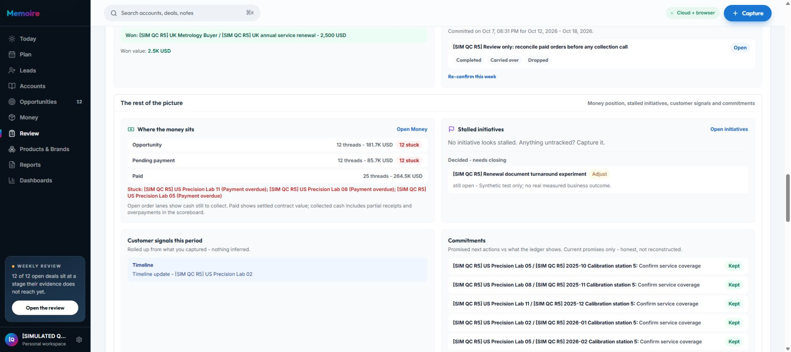
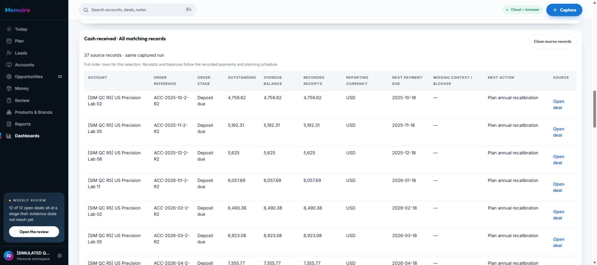
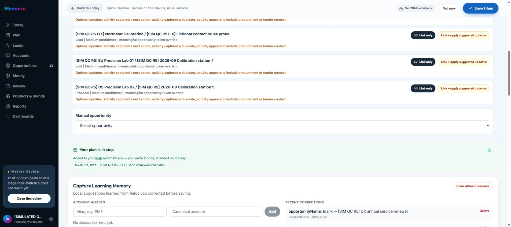
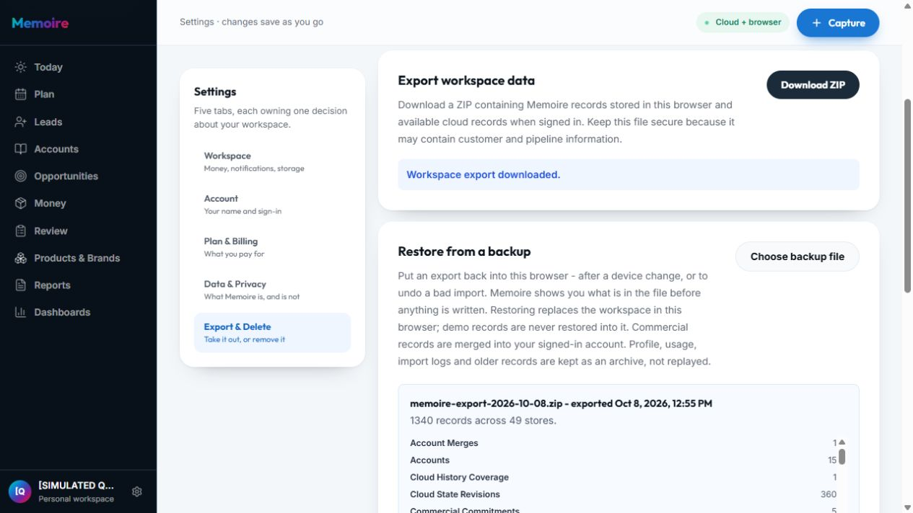

# Memoire R5 — sửa lỗi và nghiệm thu, 8 October 2026

## Kết quả và phạm vi

Đã triển khai bản sửa cho **11 lỗi xác nhận R5 (2 P1, 9 P2)** và các vấn đề copy/chất lượng liên quan. Bản production READY `dpl_26DsHFzHtmmRUm8iVAgNFV2LJvqh`, application commit **`2f89e64e54640c3031b8f3b7864b12ad4c8e9364`**, đã được promote và xác nhận tên miền `www.memoire-official.com` trỏ tới đúng deployment. Source nằm trên branch `codex/qc-r5-remediation`.

**GO cho bản sửa trong phạm vi bằng chứng dưới đây; chưa GO cho tuyên bố toàn bộ tính năng/biến thể của Memoire đều đã nghiệm thu.** Riêng R5-02: parser của ZIP nguyên bản và Restore service với cloud thật đều đạt, nhưng roundtrip ZIP → dialog mới → Restore → Undo hoàn toàn bằng UI vẫn **PARTIAL do công cụ trình duyệt**. Không dùng service integration làm bằng chứng UI đã hoàn tất.

Vòng này tiếp tục business giả lập **[SIMULATED QC R5] Orion Calibration Partners**, phân phối thiết bị/dịch vụ hiệu chuẩn tại EU/US/APAC. Giữ lịch sử 10/2025–09/2026 và oracle độc lập của [audit R5 gốc](global-b2b-round5-audit-2026-10-07.md). Đây là dữ liệu mô phỏng và checkpoint người dùng, không phải business đã chạy 12 tháng thời gian thật. Contract mapping trong nghiệm thu là record giả lập, không có thỏa thuận pháp lý hoặc sự chấp thuận của khách hàng thật.

Các application commits:

- `c75ab19`: sửa các lỗi R5 và copy liên quan.
- `8f3cf7d`: thay xác nhận Restore của hệ thống bằng dialog có focus trap trong Memoire; giữ cảnh báo và xác nhận trước khi ghi.
- `2f89e64`: lỗi bổ sung phát hiện trong retest: tiêu đề nguồn Dashboard bị thanh điều hướng cố định che sau auto-scroll. Đã thêm khoảng cuộn và nghiệm thu ảnh thực.

Không chạy DDL/migration trên Supabase dùng chung với Helm. Ba file thay đổi sẵn của người dùng được giữ nguyên, không đưa vào commit. Credentials, ZIP, cloud exports và DOM riêng nằm trong `.audit`, không đưa vào báo cáo/git.

## Ma trận xử lý lỗi

| ID | Bản sửa | Bằng chứng nghiệm thu và giới hạn |
|---|---|---|
| R5-01 P1 | Weekly Review, commercial brief, risk, retention và các consumer money flow dùng receivables/milestones chuẩn; quote/deal liên kết theo ID. Đơn trả đủ/overpay không tiếp tục stuck. Tách contract value khỏi remaining balance. | Local và staged Review: 25 Paid, 12 Pending payment, 85.671,92 USD. Brief pending PO bằng 0 cho UK đã Accepted/Won. Production Review đọc remaining balance đúng; 8 oracle và lịch sử baseline giữ nguyên. Các regression kiểm tra paid/partial/overpay và không mượn quote của deal khác đều đạt. |
| R5-02 P1 | Incident validator so sánh instant hợp lệ thay vì chuỗi ISO. Giữ kiểm tra dates, ownership, references, lineage và rollback. Restore phải xác nhận trong dialog của app, Cancel là focus đầu tiên. | Native ZIP tải trực tiếp, không chỉnh sửa: format18, 1.340 records/49 stores, có incident và contract; parse/buildRestorePlan và UI preview đạt. Current raw cloud export → actual Restore service + owner SDK: 1.345 records/46 stores, 41 collections pushed, 0 incomplete; local Undo qua adapter storage cô lập đạt. **Native UI roundtrip sau dialog mới chưa hoàn tất**, xem mục riêng. |
| R5-03 P2 | Edit next action/due đồng bộ scalar với structured list; xóa action đầu xử lý phần còn lại. Fact review dùng correction đã xác nhận cho self/internal promise khớp rõ, giữ raw evidence và các promise khác. | Local edit/save chỉ có một action. Production retest FIX2: action mới hiển thị trong Activity, Plan và fact review; raw câu cũ vẫn là evidence. Save một promise mới thành công; cloud đúng một structured action, due Oct13 và account/deal/owner chuẩn. Unit cover edit/clear/multiple/ambiguous correction. |
| R5-04 P2 | Capture facts lấy account ID từ deal chuẩn. Contract dropdown chỉ nhận promise cùng owner/account/opportunity; legacy record thiếu scope được giải thích và chặn. Không nới guard. | Promise FIX và contract mapping giả lập lưu được; cloud contract version1, commitment/deal/owner khớp. FIX2 từ production cũng lưu đúng scope. Negative scope checks vẫn đạt. |
| R5-05 P2 | Account-linked Desk work không bắt nhập customer participant. Giữ account context, ghi channel Desk work; copy mô tả work record. | Hoàn thành việc chuẩn bị nội bộ gắn UK account mà không nhập người; activity thực lưu cloud, contact/stakeholder trống. Contact interaction dates trước đó không đổi. Task complete không tự đánh dấu promise kept. |
| R5-06 P2 | datetime-local render theo local time, chuyển về ISO đúng một lần. Due date dạng ngày giữ dạng ngày. | UI nhập 18:38 Oct6 tại UTC+7 bằng native date control → Save → reopen → Save lại → reopen vẫn 18:38. Cloud đúng 11:38Z. Unit cover UTC+7, New York mùa hè/mùa đông và DST gap; không nhận unit là browser chạy ở New York. |
| R5-07 P2 | Account CSV tạo People từ profile contacts với owner/account scope, Unknown authority, không dựng customer touch. Legacy profile có nút chuyển vào People và báo added/reused/ambiguous. | CSV Northstar tạo Avery Lin, Quality Director. Reload People có đúng 1 người, authority/influence Unknown, last interaction trống. Retry profile import không thêm người. UK legacy có 2 Casey được báo cần manual review, không thêm Casey thứ ba. |
| R5-08 P2 | Lead reuse một contact khớp duy nhất trong cùng owner/account/sample scope; giữ authority và interaction date đã có. Ambiguous identity không tự merge. Sample Lead không gọi cloud People. | Sau CSV/retry, tạo Lead Northstar cùng Avery vẫn đúng một stakeholder trong cloud; Lead chưa sized, không tạo số tiền hoặc customer touch. Unit cover reuse Technical Buyer, ambiguous identity và sample isolation. |
| R5-09 P2 | Getting started coach nằm trong layout phía trên nội dung; các nhánh expanded/collapsed/graduation không phủ action. Dashboard inspect nhận focus và cuộn tới panel nguồn, có offset cho sticky header. | Guide vẫn hiện khi mouse Archive → Restore dashboard thành công, cấu hình 3 widgets giữ nguyên. Inspect 37 source rows; bản cuối panel top≈96px, header bottom=64px, tiêu đề và Close đều nhìn thấy. Kiểm thử viewport mobile thật, xem mục dưới. |
| R5-10 P2 | Board membership dựa trên kỳ đang xem và backlog toggle thật; backlog tắt mặc định. Fold ghi “Not shown on the board”, pagination theo 12 rows. | Tuần Oct5–11: 1 promise on board, 76 not shown. 72 overdue ở fold; Show 12 more: 60→48 remaining. Bật backlog: 73 promises on board, 4 not shown, 101 planned items; tắt trở lại current-period view. |
| R5-11 P2 | Kernel store so sánh object JSON theo semantic key order, giữ array order và giá trị chính xác. Same-version data khác thật vẫn reject. | Review local/staged/production không còn incident incomplete alert trong trường hợp thử; incident version2 giữ cloud. Regression accept JSONB key reorder và reject changed impact đạt. |

## Chất lượng và ý nghĩa sản phẩm

- Coverage phân biệt Won/probability-weighted support với evidence qualification nghiêm ngặt; không coi đồng tiền Won là toàn bộ bằng chứng đã đạt.
- Active pipeline copy nói rõ có Lead trong view liên quan; oracle qualified pipeline vẫn loại Lead. Risk brief nói rõ remaining balance và contract context.
- Playbook chỉ đếm objections chưa giải quyết là việc đang nợ; Library có thể học từ resolved history, copy giải thích khác biệt.
- Accounts “Now” hướng người dùng kiểm tra next action/recent changes khi chưa có urgent open-deal task, tránh kết luận chung rằng không còn việc cần chú ý.
- Forecast của deal đã đóng được mô tả như historical context. Internal preparation không được gọi là customer touch.
- Giữ kiến trúc hiện hành trong README: 10 destinations đã được duyệt. Không thêm module chỉ để che một luồng sai hoặc tạo thêm nguồn tiền/contact song song.

## Đối soát tiền và dữ liệu thật

Export sau phát hành: **56 tables, manifest complete, 988 SQL rows**, lúc `2026-10-08T06:24:35.798Z`. Có 16 accounts, 74 opportunities, 224 activities, 73 quotes, 37 receivables/costs, 6 commitments, 1 contract mapping và 1 incident. Lead Northstar không có estimated value; không tác động oracle.

| Chỉ số USD reporting | Kết quả | Oracle |
|---|---:|---|
| Orders | 37 | PASS |
| Accepted order value | 435.884,62 | PASS |
| Recorded receipts | 354.949,23 | PASS |
| Outstanding | 85.671,92 | PASS |
| Overpaid | 4.736,54 | PASS |
| Landed cost | 283.450,00 | PASS |
| Gross margin | 152.434,62 | PASS |
| Active qualified pipeline | 181.730,77 | PASS |

Baseline 72 opportunities, 216 activities, 72 quotes, 36 costs giữ nguyên ý nghĩa business. So sánh chuẩn hóa JSON key order, redundant payload owner và optional-null quote fields; không bỏ qua amount/date/status. Không nhận đây là kế toán được chứng nhận hoặc sử dụng tỷ giá thị trường trực tiếp.

**12 kiểm tra record integrity đạt:** 5 kiểm tra Capture FIX/contract/Desk work/contact dates và 7 kiểm tra CSV/retry/Lead reuse/FIX2 scalar-list/due/scope/timezone. **13 isolation checks đạt:** 10 bảng không lộ record của owner QC khác; export thiếu token, token invalid, sai owner bị từ chối. Phạm vi này không thay thế security certification cho toàn hệ thống.

## Kiểm tra source và mobile

Full check trên bản có dialog Restore mới: **117/117 nhóm**, gồm build, 113 contracts, API typecheck, lint, unit. **2.131 tests, 339 suites, 0 fail/skip**. Thay đổi cuối chỉ thêm scroll offset: kiểm tra TypeScript và eslint file liên quan đạt; remote production build của exact SHA đạt; nghiệm thu panel trong browser thật đạt.

Chrome viewport yêu cầu **390×844**, DOM thực **375×844 content** do scrollbar; document scrollWidth=clientWidth=375. Dashboard metric/source panel và close navigation/source controls dùng được, bảng cuộn trong container. Đã reset override. Đây là smoke test Dashboard tại một breakpoint; không chứng nhận toàn bộ màn hình/mobile browser/PWA/offline.

## Restore: ranh giới bằng chứng

Native export file nhận từ Download ZIP: `memoire-export-2026-10-08.zip`, 2.419.925 bytes, SHA256 `30775BA00F0D0995838D3E39EFC8971FA416318CA06F620B9332F2FC7C4D5EAA`. Không normalize timestamps trước khi kiểm tra. ZIP JSON nguyên bản được preview thành 1.340 records/49 stores; incident và contract đều được nhận.

Tab IAB cũ bị native window.confirm của phiên bản trước chặn. Dialog mới giữ preview/cảnh báo/Cancel/Confirm, có contract check xác nhận write chỉ chạy khi đã mở confirmation. Tab Chrome riêng bị tiện ích từ chối setFiles vì chưa được bật Allow access to file URLs. Không đổi quyền tiện ích hoặc giả định hộp thoại đã được hủy. Đã gửi yêu cầu hủy tab IAB cũ, chưa có bằng chứng người dùng thực hiện trong lượt này.

Để kiểm tra đường ghi mà không nới guard, gọi **actual restore service** bằng current raw cloud export, SDK đăng nhập đúng QC owner và adapter storage trong Node riêng. Server transactional history restore, các canonical upserts và local Undo đạt; export sau đó giữ oracle/baseline và Northstar. Đây là service integration với cloud thật, **không phải UI roundtrip ZIP, không chứng minh Cancel/Escape/Confirm mới hoặc retention từ ZIP cũ**. Unit kiểm tra rollback/owner/lineage vẫn đạt. Việc đã giữ những record hiện tại không thay thế nghiệm thu outside-backup scenario riêng.

## Dữ liệu cũ và các phần chưa nghiệm thu

Hai Casey trùng trong fixture trước sửa được giữ như evidence lịch sử và báo manual review. Không tự xóa/merge authority theo tên. Capture cũ bị duplicate action không tự viết lại lịch sử. Riêng timestamp của objection giả lập đã được đặt rõ thành 18:38 cho test; không suy đoán và đổi timestamp legacy khác.

Giữ các giới hạn của ma trận 38 khu vực R5 gốc: microphone, public signup/email/ToS, subscription/payment, offline/network conflicts, Founder-only import, real shared-access acceptance, federation và valid signed protocol không được chứng nhận. Không gửi email/draft, không có giao dịch tiền thật. Không dùng thao tác source/fixture để nhận các luồng này đã thành công.

Tên miền chính có session cá nhân của người dùng trên Chrome; chỉ kiểm tra app shell rồi đóng tab đó, không sign out/chuyển account hoặc sửa dữ liệu cá nhân. User journey QC sau phát hành chạy tại URL deployment chính xác, cùng bản mà tên miền chính đã trỏ tới.

## Bằng chứng bàn giao

- [Financial oracle và baseline](evidence/round5-remediation/financial-integrity.json)
- [Isolation](evidence/round5-remediation/isolation-results.json)
- [Record integrity](evidence/round5-remediation/record-integrity.json), [final user records](evidence/round5-remediation/final-user-records.json)
- [Live restore service](evidence/round5-remediation/live-restore-service.json), [native ZIP parser](evidence/round5-remediation/native-export-validation.json)
- [Exact production deployment](evidence/round5-remediation/production-deployment-proof.json)
- [117 source checks](evidence/round5-remediation/source-checks.json)

