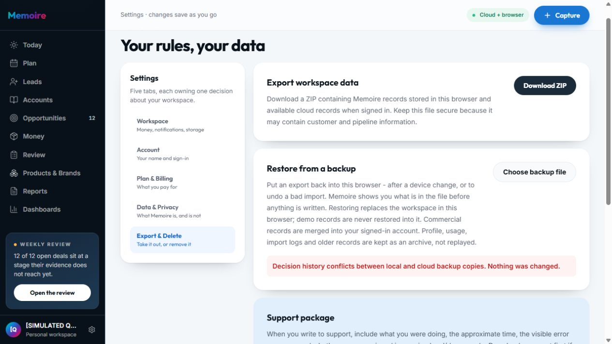
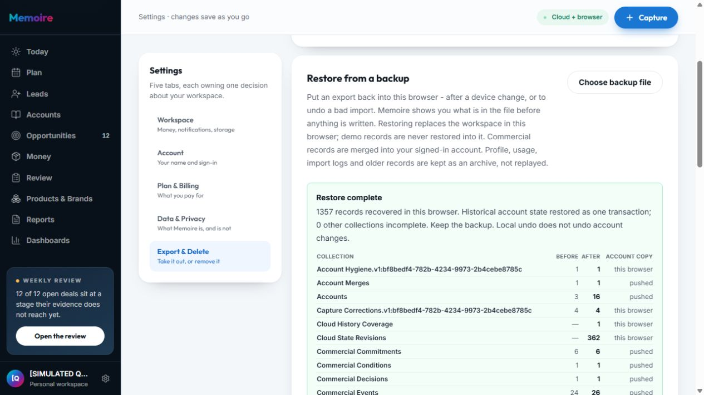

# Memoire R6 — test người dùng, Restore và độ tin cậy dữ liệu

## Kết quả và phạm vi

Vòng R6 phát hiện **4 lỗi xác nhận** và đã sửa trên production: hai lỗi native Restore, một lỗi thông tin chế độ lưu Starter Pack và một lỗi Asset báo lưu thành công khi browser từ chối ghi. **GO cho bản sửa và 12 luồng nghiệm thu bên dưới. Không kết luận toàn bộ Memoire không còn lỗi.**

Production READY: `dpl_3o6N3riqKdXP7uwHi3tf3JqyHiG4`, app commit **`a29429aefd66afabff30d2248b0ca7ada8fae31e`**. Tên miền `www.memoire-official.com` được đối chiếu lại với deployment sau promote. Release được dựng từ archive của đúng commit; không mang file thay đổi sẵn của người dùng vào bản phát hành. [PR #3](https://github.com/enexiaplatform/memoire/pull/3) chứa bản sửa R5 và R6.

Tiếp tục tài khoản business giả lập **[SIMULATED QC R5] Orion Calibration Partners**, phân phối thiết bị/dịch vụ hiệu chuẩn EU/US/APAC. Giữ năm mô phỏng 10/2025–09/2026, oracle và lịch sử của [R5](global-b2b-round5-audit-2026-10-07.md). Không tạo thêm tài khoản trong R6; đây là audit tiếp nối. Không có business chạy 12 tháng thời gian thật, giao dịch tiền, chứng nhận hiệu chuẩn hay khách hàng chấp thuận thật.

R6 tập trung đóng native ZIP → confirmation → Restore → Undo còn mở ở [nghiệm thu R5](global-b2b-round5-remediation-2026-10-08.md), rồi mở rộng kiểm tra export Report/Dashboard, action từ Plan và độ tin cậy Asset. Inventory 38 khu vực của R5 là bằng chứng lịch sử; các khu vực không thử lại không tự chuyển thành PASS trong R6.

Audit kết hợp chức năng, dữ liệu, UX và một số thao tác bàn phím. Mục tiêu: người dùng có thể tin bản sao lưu, phục hồi đủ nhóm dữ liệu được hỗ trợ, nhận lỗi lưu trung thực và truy được số tiền tới nguồn. Không phải chứng nhận WCAG hoặc security audit toàn hệ thống.

## Các luồng đã thực thi

PASS chỉ áp dụng thao tác ghi trong từng hàng. Service regression không thay thế bằng chứng giao diện.

| Bước | Luồng người dùng | Sức khỏe cuối vòng và bằng chứng |
|---|---|---|
| 1 | Tải native ZIP | **PASS UI + tệp thật.** ZIP gốc tải từ production trước sửa và ZIP mới sau sửa đều thu được, không chỉnh sửa nội dung. |
| 2 | Nạp ZIP, kiểm tra preview | **PASS sau sửa.** ZIP gốc 1.357 records/66 stores; ZIP mới 1.358/66. Decision, Observation, Incident, Contract đều có trong file và được nhận. |
| 3 | Confirmation, Cancel, Escape | **PASS UI.** Local và production: dialog mở, initial focus ở Close modal; Tab tới Cancel. Escape/Cancel đóng dialog và giữ preview. Local Cancel: so sánh toàn bộ 56 bảng không đổi dòng nào. Không gọi initial focus là Cancel. |
| 4 | Xác nhận Restore vào account QC | **PASS UI production.** Historical state được xử lý một transaction; 0 other collections incomplete; Portfolio 76/76 pushed. Cả ZIP gốc từng bị từ chối được dùng nguyên bản. |
| 5 | Giữ dữ liệu ngoài backup | **PASS UI + cloud.** Tạo asset sau ZIP gốc; Restore không làm mất asset đó. Tải lại còn 15 assets và đúng một Outside-backup checklist. |
| 6 | Undo và tải lại | **PASS UI.** Thông báo Restore undone, tự tải lại. Undo chỉ hoàn tác browser, không đảo cloud merges. Export cloud sau production Undo vẫn đủ 989 dòng. Không tuyên bố đã đối chiếu byte-for-byte toàn bộ browser storage. |
| 7 | Form Asset, lưu và ghi thất bại | **PASS UI thường + service regression.** Title trống, content/summary trống bị chặn và giữ draft. Asset QC lưu lại trên production, reload và owner export giữ nội dung. Quota: 3 ca trước sửa FAIL, sau sửa PASS; chưa ép quota trong browser thật. |
| 8 | Starter Pack và mô tả lưu | **PASS copy + dữ liệu hiện có.** 12 starter assets đã nằm trong cloud. Production bỏ “Local import”, nói rõ signed-in workspace sync; local/demo giữ trong browser. Không nhập lại mọi pack trong R6. |
| 9 | Report Collections → CSV → drill-down | **PASS UI + tệp thật.** 37 orders, 2 brand groups; CSV details 37 dòng, summary 2 nhóm, metadata 5 totals khớp oracle. CalPro drill-down 13 dòng, UK Collected/received 2.575 USD. |
| 10 | Dashboard → export → source inspect | **PASS UI + tệp thật.** Cash 354.949,23; outstanding 85.671,92; source panel 37 dòng, tiêu đề hiện dưới sticky header. ZIP có đầy đủ report details/summary và dashboard metadata. Bàn phím mở source được. |
| 11 | Plan pagination → action → Activity | **PASS UI.** Show 12 more: 60 → 48 remaining. Tuần 12–18 Oct có FIX Oct12 và FIX2 Oct13; calendar có một FIX2 action. Enter trên link mở đúng Activity, một structured action, raw câu cũ vẫn là evidence. |
| 12 | Đối chiếu tiền, lịch sử và owner | **PASS trong phạm vi.** 8 oracle, baseline business, 13 negative owner/API checks. Post-Restore cloud đủ 56 bảng/989 dòng; chỉ technical updated_at của 2 objections được DB làm mới. Không chứng nhận mọi RLS table hay mọi kiểu tấn công. |

## Lỗi xác nhận và cách đóng

### R6-01 — P1: own native ZIP bị từ chối do Decision history conflict giả

Production trước sửa trả `Decision history conflicts between local and cloud backup copies. Nothing was changed.` khi chọn ZIP vừa tải. Decision/Observation trong cloud dùng SQL timestamps `+00:00`, bản sao browser dùng `Z`; các instant bằng nhau. JSONB có thể đổi thứ tự object keys.

`workspaceBackup.ts` chỉ chuẩn hóa các top-level instant fields đã chỉ định của Decision/Observation và thứ tự object keys khi **so sánh**. File gốc không bị sửa; array order và mọi giá trị immutable giữ nguyên. Regression vẫn từ chối rationale/snapshot/cutoff bị đổi, array đổi thứ tự, date không hợp lệ và owner khác. ZIP gốc đã Restore qua UI production với 0 incomplete. **CLOSED.**

### R6-02 — P1: Portfolio bị refused khi Restore đã qua preview

Lần Restore local đầu sau sửa R6-01: history transaction và Decision/Observation thành công nhưng receipt báo 1 collection incomplete, `Portfolio Records 76 76 refused`. So sánh payload chỉ ra **74 records mất field userId** khi `parsePortfolioRecord`/merge trả bản typed đã bỏ metadata; DB guard xem payload cùng version nhưng khác dữ liệu là xung đột.

Restore vẫn dùng parser/merge để chứng minh lineage, rồi replay nguyên raw payload của bản thắng. Nếu version bằng nhau, giữ đúng accepted cloud copy. Regression kiểm tra retained metadata và proven descendant, đồng thời vẫn chặn edit chưa tăng version hoặc prior history bị sửa. Không nới SQL guard, không chạy migration. Native local và production receipt: Portfolio 76 pushed, 0 incomplete. **CLOSED.**

### R6-03 — P2: Starter Pack nói local trong khi assets sync cloud

Assets UI nói “Packs are local” và “Local import” dù QC owner có 12 imported starter records ở cloud, tổng 15 assets. Sai thông tin khiến người dùng khó hiểu dữ liệu đi đâu.

Sửa mô tả theo workspace mode, nhãn thành “Editable templates”. Đã đọc lại copy trên production. Không thay đổi nơi lưu hoặc quyền truy cập. **CLOSED.**

### R6-04 — P1: Asset trả saved khi browser từ chối ghi

Service reproduction với storage từ chối do quota: create/update không báo lỗi, bulk import/delete trả true. `persistSalesAssets` bỏ qua `{ok:false}` từ local write guard rồi tiếp tục sync; UI vì thế có thể nói saved khi bản browser chưa ghi được. **Đây là reproduction ở service test, không phải quota được ép trên production browser.**

Sửa để false local write dừng sync; create/update từ chối trả record chưa lưu; delete chỉ phát cloud delete sau local save thành công. UI giữ form/draft và báo not saved/not imported/not deleted. 3 regression trước sửa FAIL, sau sửa PASS; normal production save/reload đạt. **CLOSED trong phạm vi source/service đã kiểm chứng; browser quota acceptance vẫn chưa chạy.**

## Dữ liệu và tài chính

ZIP gốc `memoire-export-2026-10-08 (1).zip`: SHA256 `1B0AAA942AE3A4199732F6AACAE68E086DAA24BC32D3A75E639E30E5259993D1`, exported `2026-10-08T10:50:49.848Z`, format18. ZIP mới `(2).zip`: SHA256 `5345599B91812993EB70AD3AE5F5B4524695BF5B61438541FD4DCD1093CF47D3`, exported `2026-10-08T11:27:39.700Z`, format18; fresh UI preview và pure parser đạt. Fresh ZIP chưa chạy thêm một lần Confirm; nghiệm thu Confirm dùng ZIP gốc nguyên bản.

Pre-R6: 988 cloud rows; tạo Outside-backup checklist: 989. Post production Restore/Undo: **989 rows/56 tables, manifest complete**; 16 accounts, 74 opportunities, 224 activities, 73 quotes, 37 receivables, 37 costs, 76 portfolio records, 15 assets. Một Asset save lại sau nghiệm thu chỉ cập nhật chính asset QC, không tăng số dòng hoặc đổi nội dung.

| Chỉ tiêu USD quy đổi | Sau production Restore/Undo |
|---|---:|
| Orders | 37 |
| Order value | 435.884,62 |
| Received | 354.949,23 |
| Outstanding | 85.671,92 |
| Overpaid | 4.736,54 |
| Landed cost | 283.450,00 |
| Gross margin | 152.434,62 |
| Active qualified pipeline | 181.730,77 |

**8/8 oracle đạt** với sai số float nhỏ hơn 0,001 USD. Baseline 72 opportunities, 216 activities, 72 quotes, 36 costs giữ ý nghĩa business. Baseline comparison chỉ chuẩn hóa JSON key order, redundant payload owner và optional null quote fields; không bỏ qua amount/date/status. Post-Restore full-row comparison bỏ duy nhất `objections.updated_at` được DB trigger chạm ở hai rows; các field còn lại, accepted history và ngoài-backup asset giữ nguyên. Không gọi mọi dòng byte-identical.

13 negative checks: QC anon SDK không đọc được foreign-owner rows ở 10 canonical tables; export API từ chối missing/invalid token và foreign owner. Đây là scope isolation checks, không phải chứng nhận bảo mật hoàn chỉnh.

## Chất lượng, ý nghĩa và phần thiếu

**Điểm mạnh được thấy trực tiếp:** cùng một số phải thu xuất hiện nhất quán ở Report, Dashboard và oracle; người dùng mở được số tổng xuống nguồn. Restore có preview, xác nhận riêng, recovery receipt và lời nhắc Undo chỉ tác động browser. Plan giữ raw evidence trong Activity nhưng dùng action đã sửa cho công việc.

**Sự lặp có ý nghĩa:** Money quản lý đơn/receipts; Report trả lời câu hỏi lặp lại; Dashboard so sánh nhiều số và giữ cấu hình; Today/Plan ưu tiên việc. Không cần bỏ một destination chỉ vì cùng hiển thị cash. Điều cần giữ là một nguồn định nghĩa và source links; lỗi money divergence của R5 cho thấy rủi ro khi consumer tự tính.

**Cơ hội UX, chưa gắn nhãn defect mới:** Activity đồng thời ghi “Opportunity: Not captured” và “Linked opportunity: …” để giữ sự khác nhau giữa raw capture và liên kết được xác nhận. Có thể làm rõ hai nhãn để người dùng mới hiểu nhanh. Các destination phụ như Assets/Ask/Playbook cần được tìm qua search hoặc contextual links; vòng này truy được chúng nhưng chưa có usability study người dùng mới. Quota warning nên được nghiệm thu bằng môi trường browser có storage giới hạn ở vòng sau; không dùng UI validation thông thường để thay thế.

**Giới hạn tiếp tục:** R6 chưa chạy lại full suite UI của mọi khu vực trong inventory 38; chưa kiểm chứng mới mobile/PWA/offline/reconnect, multi-device conflicting edits, mọi template/import mapping, live mailbox/CRM, mọi mức shared access, valid signed federation/protocol/capsule, admin-only Founder import, checkout/payment/password/delete-account. Thiếu prerequisite/quyền không được coi là bug hoặc giả lập thành PASS. Các luồng không thực thi giữ trạng thái và ranh giới của báo cáo trước.

Không kết luận accounting completeness từ Report/Dashboard current workspace view. Metadata nêu planning FX ngày 2026-08-01 và browser-copy limits; không suy diễn thành tỷ giá thị trường hiện tại hoặc báo cáo tài chính được chứng nhận. Không dùng các template proof làm bằng chứng certification/customer acceptance.

## Kiểm tra và bàn giao

Full source check trên bản sửa cuối: **117/117 nhóm** gồm build, 113 contracts, API typecheck, lint, unit; **2.139 tests/339 suites, 0 fail/skip**. Restore regressions 35/35; 3 quota regressions đạt riêng. Remote build của exact app commit đạt. Native UI/browser evidence và owner SDK checks được ghi riêng ở bảng trên.

Không chạy DDL/migration trên Supabase dùng chung Helm. Giữ nguyên ba file thay đổi sẵn của người dùng. Credentials, raw cloud exports, ZIP và DOM private ở `.audit`; chỉ ảnh business giả lập và kết quả tổng hợp an toàn được đưa vào [evidence R6](evidence/round6/acceptance-summary.json).

Output: `docs/qa/global-b2b-round6-audit-2026-10-08.md`; bằng chứng: `docs/qa/evidence/round6/`. Báo cáo R5 giữ nguyên như bằng chứng lịch sử; trạng thái native Restore R5-02 được cập nhật bởi nghiệm thu R6 này.
