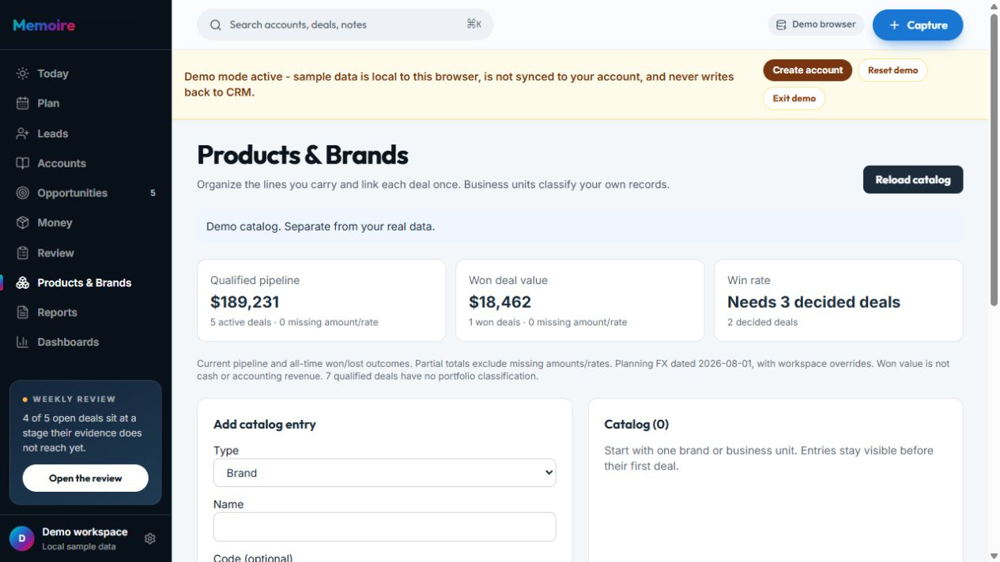
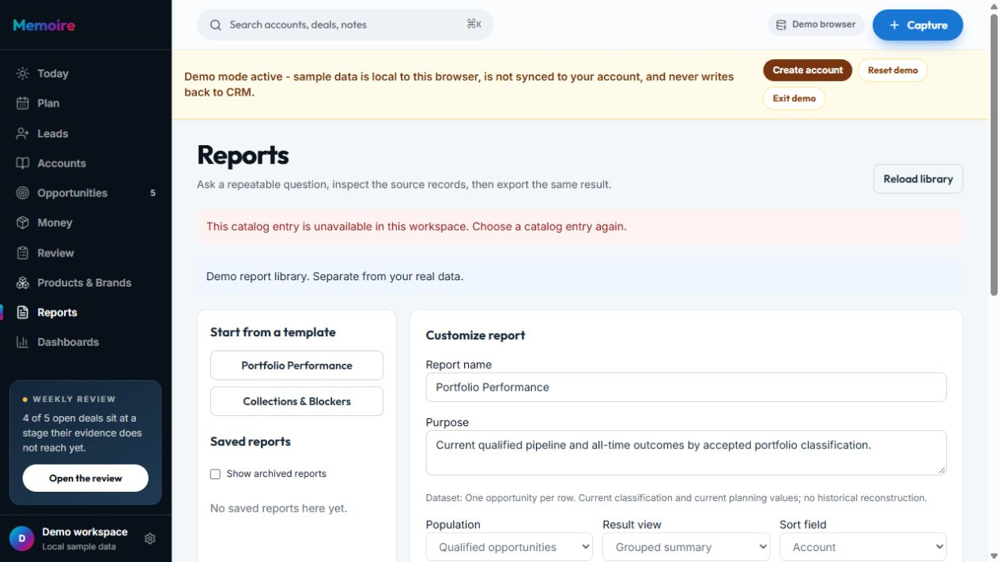
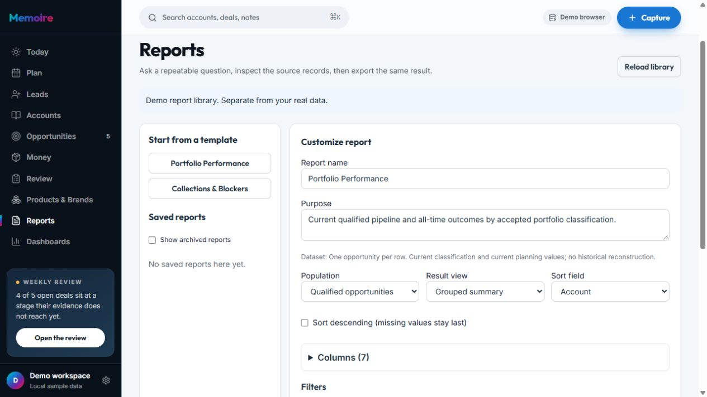

# Audit liên kết, logic và công sức sử dụng — 2026-10-01

## Kết luận trong phạm vi kiểm tra

Đợt này kiểm tra công việc đi xuyên qua các màn hình, thay vì chỉ kiểm tra mỗi trang có mở được hay không. Đã sửa các bước phải chọn lại ngữ cảnh, hai liên kết Money sai, lỗi trạng thái ở lần lưu đầu tiên và một phần đọc brand trùng trong Review.

Ba mục mới vẫn độc lập theo yêu cầu: Products & Brands quản lý phân loại; Reports định nghĩa câu hỏi và xuất kết quả; Dashboards trình bày các câu hỏi đã lưu. Chúng dùng chung bản ghi nguồn và chỉ số, không yêu cầu nhập lại doanh thu hoặc tạo thêm bản sao deal.

Đây là bằng chứng cục bộ và dữ liệu mẫu. Không phải chứng nhận mọi tính năng đã phù hợp với mọi người dùng hoặc đã vận hành đầy đủ trên Production. Các giới hạn cloud và Production trong [audit trước](product-audit-release-2026-10-01.md) vẫn là gate riêng.

## Vai trò và đầu ra cần thiết

| Mục | Công việc chính | Liên kết tạo giá trị | Điều kiện tránh dư thừa |
| --- | --- | --- | --- |
| Capture | Ghi lại sự kiện thương mại | Gắn vào account/deal, tạo ngữ cảnh và việc tiếp theo | Ghi một lần; người dùng xác nhận thông tin |
| Today | Chọn việc cần làm hôm nay | Mở đúng nguồn rủi ro/cam kết | Giới hạn ưu tiên; không trở thành kho báo cáo |
| Plan | Đặt lịch và thực hiện cam kết | Dùng việc đã ghi, liên kết lịch sử | Không nhập lại một việc ở nhiều nơi |
| Leads | Làm rõ và qualify đầu mối | Chuyển cùng bản ghi sang Opportunity | Không cộng lead vào pipeline đủ điều kiện |
| Accounts | Khôi phục ngữ cảnh khách hàng | Deal, hoạt động, người liên quan và khoảng trống coverage | Bản đọc theo khách hàng, không thay report tùy chỉnh |
| Opportunities | Quản lý tiến trình và hành động của deal | Capture, account, quote, phân loại Products | Một bản ghi làm nguồn; phân tích sâu nằm theo ngữ cảnh |
| Money | Theo dõi order → thu tiền → margin | Cùng deal/quote/payment nguồn | Giá trị Won, giá trị order và tiền thu là ba đại lượng riêng |
| Review | Khép kỳ làm việc và quyết định việc tiếp theo | Plan, lịch sử, outcome, learning | Đọc theo kỳ; chuyển đọc portfolio hiện tại/toàn thời gian về Products |
| Products & Brands | Phân loại BU/brand/group/product | Mở report đúng đối tượng; liên kết deal nguồn | ID chuẩn, xác nhận mapping; không tự phân bổ giá trị bundle |
| Reports | Đặt câu hỏi lặp lại, xem nguồn, export | Một định nghĩa lưu được dùng lại trong Dashboard | Không sao chép số; thay cấu hình phải chạy lại |
| Dashboards | Đọc và so sánh câu hỏi đã lưu | Drill-through cùng tập nguồn, mở saved report | Không có metric engine thứ hai; chỉ số một nhóm ưu tiên thẻ số |
| Search / Settings / Backup | Tìm đúng chỗ và duy trì dữ liệu | Điều hướng, phạm vi và khôi phục | Công cụ chung; không thêm mục nghiệp vụ chính |

Các lớp policy/incident/condition/observation/sharing/exchange hiện có vẫn cần một tình huống cụ thể, nguồn và thẩm quyền rõ ràng. Không biến chúng thành bước bắt buộc của luồng bán hàng thông thường và không thêm mục điều hướng chính. Không xóa những năng lực này chỉ dựa vào suy đoán không có người dùng; việc cắt tiếp cần dữ liệu sử dụng thật.

## Những điểm đã sửa và lý do

1. **Deal → phân loại:** thêm `Classify this deal` trong deal hiện có. Products nhận đúng ID và chọn sẵn deal. Không phải tìm lại khách hàng/deal; thay đổi deal cần được lưu trước khi rời editor.
2. **Danh mục → report:** mỗi entry có `View performance report`. Report khởi tạo phạm vi bằng ID chuẩn và điều kiện AND. Đổi tên entry không đổi tập phân loại. Liên kết không tồn tại/sai loại/sai workspace báo lỗi và khóa Run/Save, không âm thầm chạy report toàn bộ.
3. **Report → dashboard:** chỉ hiện `Create dashboard from this report` khi cấu hình khớp bản đã lưu. Dashboard chuẩn bị một widget tham chiếu đúng report, không tự lưu. Ưu tiên pipeline/outstanding khi có trong report; dùng chỉ số hợp lệ khác nếu chỉ số đó không được chọn.
4. **Loại biểu đồ có lý do:** khi mọi chiều nhóm đã bị cố định bằng điều kiện equals/AND, dùng metric card thay vì một biểu đồ chỉ có một nhóm. Có nhóm biến thiên thì đề xuất bar chart. Đổi nguồn sang report không có grouping sẽ chuyển bar sang metric; không cho chọn bar với nguồn không có grouping.
5. **Đường dẫn report:** chọn hoặc lưu report cập nhật ID trong URL; reload và Back mở đúng câu hỏi. Chuyển template/duplicate bỏ ID cũ. Kết quả đã tính không bị mất chỉ vì lưu lần đầu.
6. **Lần lưu đầu tiên:** sửa điều kiện so sánh hai ID chưa tồn tại vốn có thể đưa editor về trạng thái chưa lưu. Report/dashboard mới giữ đúng ID/version sau Save.
7. **Money:** sửa report Collections → `/app/revenue?view=collections` và empty-state Collections → Orders. Cả hai liên kết trước dùng `/app/money`, chưa có route.
8. **Giảm trùng trong Review:** chuyển đọc brand từ văn bản gốc sang phần kiểm tra phân loại trong Products, mặc định đóng và chỉ xuất hiện khi có brand text. Review giữ liên kết tới Products. Không để tổng hiện tại/toàn thời gian bị hiểu là kết quả của kỳ review đang chọn.
9. **Không lưu dashboard vô nghĩa:** Save bị khóa khi chưa có widget. Bản chạy hiện tại được giữ sau khi lưu để người dùng không phải Refresh lại cùng câu hỏi.
10. **Nghĩa hierarchy:** nói rõ số liệu catalog theo phân loại trực tiếp; parent tổ chức cây nhưng chưa cộng dồn child. Không khẳng định một tổng BU bao gồm con khi engine chưa làm vậy.

Những thay đổi này bỏ việc tìm/chọn lại và sửa câu hỏi sai. Chưa đo số giây tiết kiệm hay tỷ lệ quay lại bằng nghiên cứu người dùng; không dùng số đo suy đoán để tuyên bố UX đã tối ưu hoàn toàn.

## Kiểm chứng xuyên suốt

`verify-product-linkage-browser.mjs` dùng fixture biệt lập: Alpha 100, Beta 200, Won 50, Lead 900; order 60 và receipt 20. Chọn Alpha vào Brand A, mở report từ Brand A:

- Qualified pipeline trong Report và Dashboard đều **100**; lead 900 không bị cộng vào pipeline.
- Cả hai đọc cùng hai bản ghi Brand A: Alpha và Won. Drill-through không đổi tập nguồn.
- Lưu report cập nhật URL; reload, chọn report khác và Back giữ đúng ID/câu hỏi.
- Sửa purpose chưa lưu làm ẩn handoff; sau Save mới cho dùng cấu hình trong Dashboard.
- Dashboard draft không tự tạo bản ghi. Refresh rồi Save giữ kết quả đang nhìn; reload giữ tham chiếu report.
- Mở Collections từ report tới đúng tab. Khi không có committed order, Open Orders tới đúng Orders.
- Catalog ID thiếu, sai loại và report ID không tồn tại đều không chạy report mặc định khác.
- Demo không gọi cloud cho ba bảng definitions/catalog. Mobile không tràn ngang; link report của brand có vùng chạm ít nhất 44px.

Full `npm run check` đạt **2.075 tests**, build, API typecheck, lint và contract suite. Đã chạy lại 7 browser journeys liên quan: portfolio, reports, dashboards, linkage, standalone navigation, next-gen và money consequence. Sau các chỉnh sửa cuối về loại widget/ẩn phần không có dữ liệu, chạy lại unit handoff, linkage, build/lint và contract brand; các kết quả cụ thể được giữ trong `.memoire-private/logic-audit-*.log`. CI của commit phát hành kiểm tra lại toàn bộ mã cuối.

## Đối chiếu giao diện trong audit này

Ảnh do in-app browser chụp trong đợt này, lưu và xem lại trước khi nhận làm bằng chứng. Không sửa dữ liệu của tab người dùng. Luồng đầy đủ có dữ liệu được kiểm tra bởi fixture trình duyệt ở trên; ảnh dưới đây là kiểm tra trạng thái demo đang có, không giả làm ảnh của fixture đã tạo dashboard.

### 1. Products không hiển thị phần kiểm tra rỗng — đạt

Demo này chưa có brand text, vì vậy phần đọc văn bản gốc không hiện. Catalog và chỉ số vẫn rõ nguồn/phạm vi. Khi có brand text, phần kiểm tra mở theo yêu cầu, không là panel bắt buộc.

### 2. Liên kết tới entry không còn tồn tại — đạt

Thông báo đúng lý do; các control Run/Save bị khóa trong DOM. Không có kết quả từ một câu hỏi khác được trình bày thay thế. Người dùng có thể chọn template hoặc saved report khác.

### 3. Chọn template để tiếp tục — đạt

Lỗi được bỏ sau lựa chọn rõ ràng; builder được mở lại và URL chuyển thành report mới. Không tạo bản ghi chỉ vì điều hướng.

## Phần chưa được khẳng định

- Chưa có đo thời gian hoàn thành công việc của người dùng thật; không cam kết mọi người sẽ cần mọi chức năng nâng cao.
- Editor có thể mất thay đổi chưa lưu nếu rời trang; handoff từ report đã chặn cấu hình chưa lưu và deal có nhắc lưu trước. Chưa có cơ chế draft xuyên tất cả các editor.
- Tree hierarchy chưa roll up, quyền BU/organization chưa được suy ra từ classification, lịch sử của một số nguồn legacy còn giới hạn. Không thêm dữ liệu giả để lấp các chỗ này.
- Cloud definitions, OAuth Preview và gate backup/schema Production vẫn cần acceptance riêng. Không có migration hoặc customer-data mutation trong audit này.
